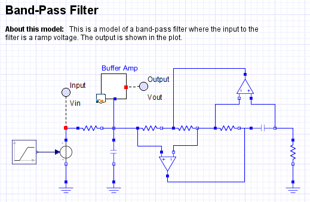
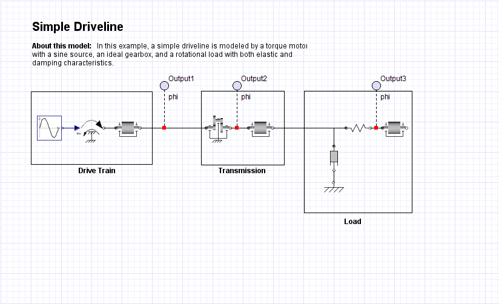
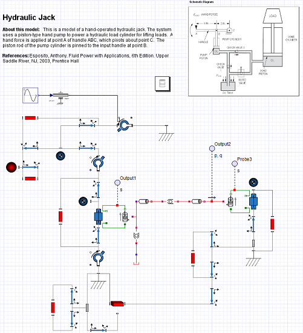
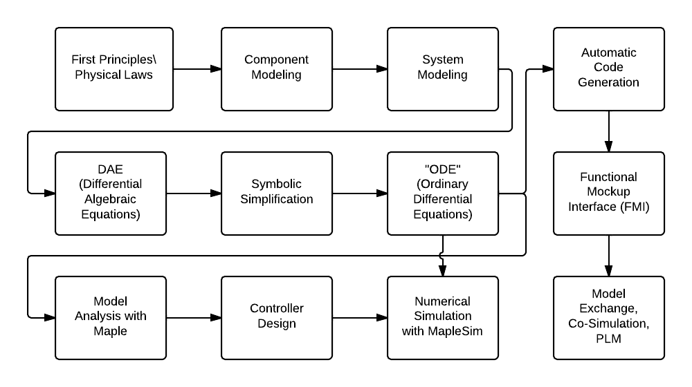
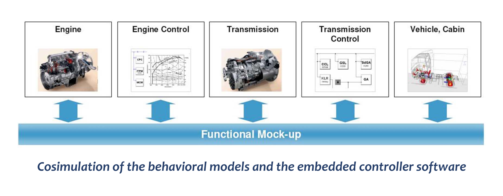
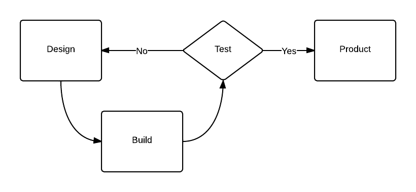
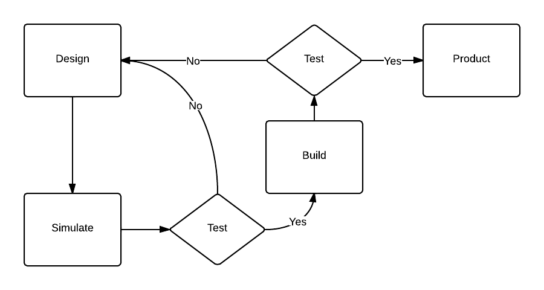
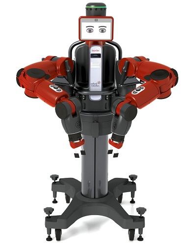

## Virtual Prototyping

Behzad Samadi, PhD  
[Mechatronics3D](http://www.mechatronics3D.com)  
DIPECC 2014, Dubai  
April 9, 2014

# It All Started with LEGO!

## LEGO MINDSTORMS NXT

  
[LEGO^®^](http://mindstorms.lego.com)

## LEGO MINDSTORMS EV3

  
[LEGO^®^](http://mindstorms.lego.com)

## Visual Programming

NXT-G  
  
[LEGO^®^](http://mindstorms.lego.com)

## Open Software

## Open Hardware

## Bicycle

  
Razyeh Mousavi

## Ballbot

## NXTway

  
[Hamid Bazargani](http://engcast.com/main/)  
[NXTway-GS](http://lejos-osek.sourceforge.net/videos.htm)

## Ball on Plate

## Electronics Stability Control

  
[Reza Azimi](http://brown.edu/research/labs/engineering-man-machine-systems/systems/people/students/razimi)  
[NXTway-GT](http://lejos-osek.sourceforge.net/videos.htm#NXT_GT_Hi)  

## LEGO MINDSTORMS

It was very exciting at first but I had more than 40 students and only 3 sets of LEGO Mindstorms!

## Amazing Journey

We realized that before making the robot, there were a lot of things that we needed to learn.

## Operating System

## Virtual Robot

## 3D Animation

## Controller Design

## How About a Virtual LEGO Set?

- This virtual robot is interesting but what if I want to build another robot?
- How hard is it to build a virtual robot?

## Causal Modeling 

- Writing the dynamic equations
- Converting the equations to ordinary differential equations
- Creating a signal flow model e.g. a Simulink model
- Building a virtual robot seems to be different from building a real robot

## Virtual LEGO Set

What if we had a set of virtual LEGO parts and we could build a robot with them?

## Virtual LEGO Set

We made one!  
  

- [ODE](http://www.ode.org/) (Open Dynamics Engine)
- [IrrLicht](http://irrlicht.sourceforge.net/) (Visualization)  

Alborz Gharraee

# Acausal Modeling

## Modelica and MapleSim 

- The connections between components are physical connections like position, voltage, flow,...
- Acausal modeling is very similar to building a real system

## Electrical Systems

## Mechanical Systems

## Hydraulic Systems

## Thermal Systems

## Chemical Systems

## Acausal Modeling with MapleSim

## Functional Mockup Interface

- Model Exchange, Co-Simulation, Product Lifecycle Management
- There are over 35 [Tools](https://www.fmi-standard.org/tools) supporting FMI

Courtesy of [ITAE](https://itea3.org/)

# Model Based Development

## The V Diagram

from [engineering.com](http://www.engineering.com/DesignSoftware/DesignSoftwareArticles/ArticleID/7352/Model-Based-System-Engineering--Beyond-Spreadsheets.aspx)

## Trial and Error

    
Expensive, time consuming, not reliable

## Model Based Approach

## Model Based Development

  
Saves resources, time, money

Courtesy of [ITAE](https://itea3.org/)

## Old Approach

- Easy: build the model and design the controller in a high level environment like MATLAB\Simulink
- Hard: rewrite your code for the hardware controller on the physical prototype
- Problem: rewriting the code is time consuming and error prone

## Modern Approach

## Software in the Loop

- The controller and the virtual prototype are two different applications.
- The applications "talk" to each other using a "middleware".
- The controller doesn't see the difference between the virtual and physical prototypes.
- Software engineers do not have to wait for the hardware!

## Middleware

- Using the same language to exchange messages 
- Components can be replaced without affecting the whole system

##

##

##

# Robot Operating System

## What is ROS?

- a set of software libraries and tools 
- from drivers to state-of-the-art algorithms
- powerful developer tools
- open source.

## 

  

## PR2 by Willow Garage

  

[Willow Garage is changing](http://spectrum.ieee.org/automaton/robotics/robotics-software/willow-garage-to-shut-down)

## TurtleBot

  

## Husky

  

[Clearpath Robotics](http://www.clearpathrobotics.com/), Waterloo, Ontario

## Baxter

  

[list of robots](http://wiki.ros.org/Robots)

## ROS Industrial and MoveIt

  

  

[list of robots](http://moveit.ros.org/robots/)

[src](https://www.youtube.com/watch?v=dblCGZzeUqs) 

## NXT ROS

  

[brown-ros-pkg](https://code.google.com/p/brown-ros-pkg/wiki/ROSProcessingjsNXT)

## ROS 101

  

## ROS 101

  

## ROS 101

  

[more](http://www.clearpathrobotics.com/blog/how-to-guide-ros-101/)

## Camera

  

[Mike Charikov](https://www.youtube.com/watch?v=_8AhNWKzv2k) 

## OpenCV

  

## OpenCV

   

motion, line, face, feature detection

## Depth Estimation with OpenCV

  

[src](https://www.youtube.com/watch?v=LbtTsKiSQkE) 

## Gesture Detection with OpenCV

  

[src](https://www.youtube.com/watch?v=B4dwu3si9x0) 

## CloudSim

  

# Resources

## Bookmarks

- [MapleSim](http://www.maplesoft.com/products/maplesim/)
- [Clearpath Robotics](http://www.clearpathrobotics.com/)
- [Open Source Robotics Foundation](http://osrfoundation.org/)
- [ROS](http://www.ros.org/)
- [ROScon](http://roscon.ros.org/)
- [ROS Cheat Sheet](http://www.clearpathrobotics.com/wp-content/uploads/2014/01/ROS-Cheat-Sheet-v1.01.pdf)
- [Gazebo](http://gazebosim.org/)
- [Orocos](http://www.orocos.org/)
- [MORSE](http://www.openrobots.org/wiki/morse/)
- [JdeRobot](http://jderobot.org/)
- [The Robotics Challenge](http://www.theroboticschallenge.org/)
- [Rethink Robotics](http://www.rethinkrobotics.com/)
- [Dr. Robot](http://www.drrobot.com/)
- [Best practices in robotics](http://www.best-of-robotics.org/)

## Bookmarks

- [OpenCV](http://opencv.org/)
- [Robot App Store](http://www.robotappstore.com/)
- [Robot Web Tools](http://robotwebtools.org/)
- [Robohub](http://robohub.org/)
- [Silicon Valley Robotics](http://www.svrobo.org/)
- [Suitable Technologies](https://www.suitabletech.com/)
- [Popular Science](http://www.popsci.com/category/tags/robots)
- [Robot Standards](http://www.robot-standards.eu/)
